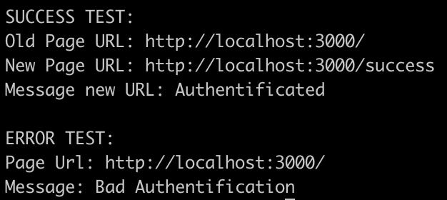

# Log-page-with-puppeteer

STEPS:

At first let's put the 'User test' on your DB.

- Open a port at 'mongodb://localhost:27017'
- On the server's folder type: "node generate.js"

Congrats the user is on your database now.

Next of it install all the package on each folders (Npm install || yarn install)

### `Client's Folder`

Then run the APP (npm start || yarn start)

The App will run at `http://localhost:3000`

### `Server's Folder`

Same as previously run the app (npm start || yarn start)

The app will run at `http://localhost:8080`

### `Puppeteer's Folder`

Now let's launch the tests

Like the others folders just type: "npm start" || "yarn start"

You should have a Message on your console:

Thanks !
